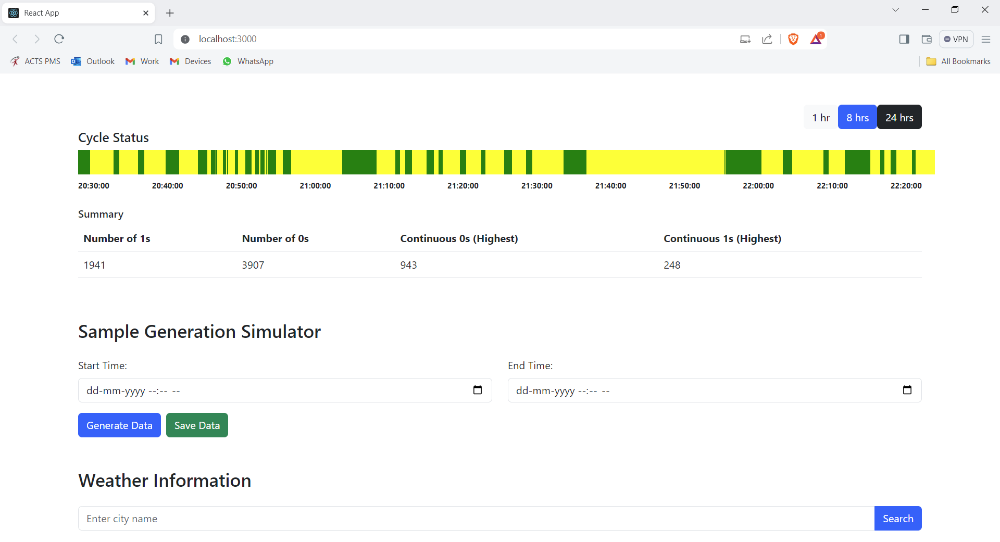
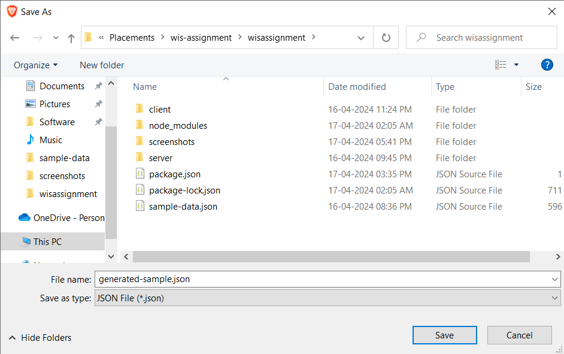
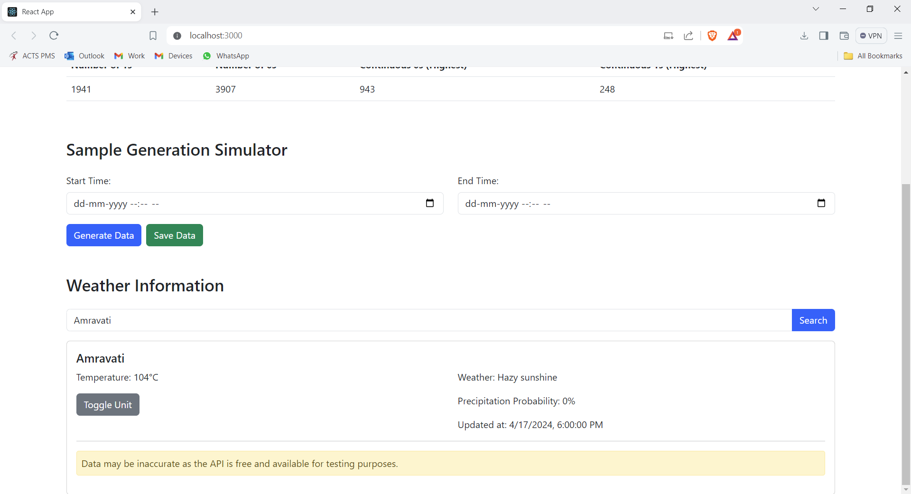

# MERN Project: Horizontal Time Scale Plot and Weather API integration

### Submitted By: Shubham Samarth (PD0504)
### Task Assigned By: Wathare Infotech Solutions
### Date: April 17, 2024

## Description
This project implements a Horizontal Time Scale Plot to visualize sample data over time and showcases Weather API integration. The project utilizes a MERN stack (MongoDB, Express.js, React.js, Node.js) to manage data, serve APIs, and render the user interface.

## Project Structure
- **Server**: Backend server for managing data and serving APIs.
- **Client**: Frontend application built with React.js for user interface.

## Instructions

### Running the Server
1. Navigate to the server directory:
    ```
    cd wisassignment\server
    ```
2. Start the server by running the following command:
    ```
    node server.js
    ```

### Running the Client
1. Navigate to the client directory:
    ```
    cd wisassignment\client
    ```
2. Start the client application by running the following command:
    ```
    npm start
    ```

### Assignment Details
- **Importing Sample Data**:
    - Import raw sample data set to a DB Collection.

- **Horizontal Time Scale**:
    - The project represents data on a horizontal time scale.
    - Timestamps are provided in the sample raw data.

- **Data Visualization**:
    - Plot yellow if the sample is 0, green if the sample is 1, and red if the sample is missing.

- **Summary Generation**:
    - Generate a summary in tabular format, including the number of 1s, the number of 0s, and continuous variations of 0s and 1s.

- **API Development**:
    - Write APIs to filter the data based on time ranges.

- **Third-Party Integration**:
    - Integrate a third-party API to fetch location and related temperature data from the internet.

- **Bonus**:
    - A sample data generation simulator is provided in JavaScript.

## File Information
- **Provided Sample Data File**: `sample-data.json`
- **Generated Sample Data File by Simulator**: `generated-sample.json` (Timestamps are in UTC)

## Screenshots
*Data Visualization*


*Sample Generation (Input)*


*Generated Sample*


*Weather Information*


## Disclaimer
- **Data Accuracy**:
    - Data obtained from the third-party API may be inaccurate as the API is free and available for testing purposes only.